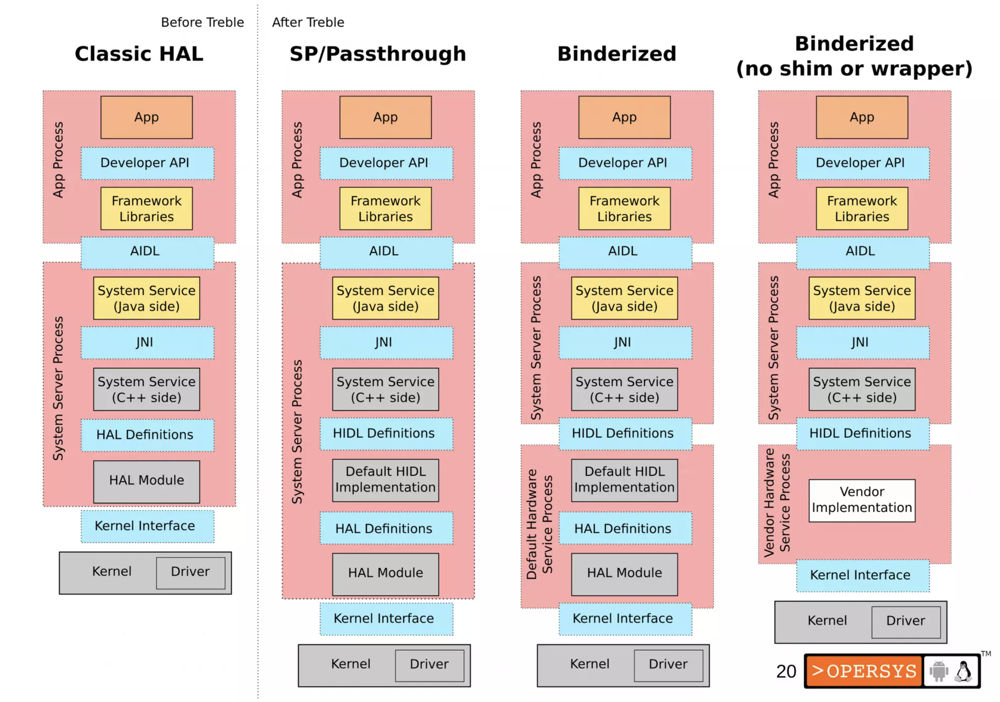

# Android Treble Project 解耦

## 背景

Android 作为全球搭载设备的最多的移动操作系统，一直面临着Android版本碎片化的问题。下图是Android 版本的分布图，相比于竞争对手IOS而言，Android的版本的碎片化问题更为严重。版本的碎片化导致开发者必须花费更多的精力去适配多个SDK版本，并且新功能和安全补丁需要更长的时间才能推送到最终用户手中。

为了优化此问题，Google在Android 8.0的时候，引入了Android Treble Project，对整个Android从系统架构层面进行了解耦。Android 作为全球最大的移动端开源操作系统，源码多达100G+。我们来了解一下Google是如何对这种超大系统进行解耦的，探讨Android Treble解耦背后的实现逻辑和设计思想，也可以为我们进行系统级别的解耦提供参考。

<figure><figcaption><p>Android 版本分布统计图</p></figcaption></figure>

### Android碎片化的原因

Android碎片化的原因很多，最主要的一个原因是，Google自己制造的Android终端设备非常少，大部分Android终端都是有其他手机厂商制造的，所以Android大版本的升级需要下游众多的手机芯片厂商和手机制造商的紧密配合。Google每Release一个Android大版本，都需要手机芯片厂商和手机制造商花费很大的精力去做适配，而且整适配过程会持续几个月甚至半年时间。下面是一个传统Android设备的开发流程，会经历下面几个阶段：

<figure><figcaption><p>传统Android 设备开发流程</p></figcaption></figure>

#### Google Release Android X 版本&#x20;

Google release开发并且迭代完一个大Android版本之后，首先会把Android源码给到手机芯片厂商。常见的芯片厂商例如QCOM、MTk等厂商。

#### 手机芯片厂商

芯片厂商收到新版本的Android Release之后，在此Release的基础上添加特定芯片平台的SOC代码，可能包括特定soc平台的内核驱动、引导程序**、**TEE等等。

#### 手机制造商

芯片厂商将加入芯片平台代码的新版本Android源码，release给使用他们芯片的手机制造商。手机制造商加入自己特定设备的修改，并经过几个迭代的测试之后，最终将新版本Android编译打包成OTA升级，通过OTA的方式给终端用户推送更新。

从上面的整个流程我们可以看到，一个Android版本的从Google Release到推送到终端用户手中，要经历**Google -> 芯片厂商 -> 手机制造商**至少三层的迭代开发和测试，整个过程及其漫长。对于手机制造商和芯片厂商来说，适配一个新的Android版本需要花费极大的人力和时间，所以芯片厂商和手机制造商可能没有充足的精力去适配所有的设备，导致新版本Android需要很长时间才能Release到最终用户手中。

### 解决方案

从传统Android设备适配新的Android版本的流程中我们可以看到，导致碎片化的原因主要是Android新版本要经过芯片厂商和手机厂商的适配。那么有没有可能，一个新Android版本的Release，不需要或者极大的减少芯片厂商的适配呢，有没有可能将手机制造商、手机芯片厂商和Android开源部分的代码解耦并分离开，各自独立更新和维护？这个问题的答案就是Android Treble Project。

## Android Treble Project&#x20;

Android Treble Project是Android 8.0引入的系统级解耦方案，官方宣称是Android系统历史上最大的一次改动。首先我们看看Android Treble引入前后系统架构的变化。关于Android Treble的理论分析请参见[ACM Project Treble](https://dl.acm.org/doi/10.1145/3358237)。

首先我们对比一下Treble重构前后，Android系统框架的变化。

### Trreble重构前后系统架构对比

重构前：

<figure><figcaption><p>Treble重构前Android架构</p></figcaption></figure>

重构后：

<figure><figcaption><p>Treble 解耦后Android架构</p></figcaption></figure>

上图中灰色部分是需要芯片厂商和手机制造商需要适配和修改的部分，称之为**Vendor**，淡黄色部分是Android Framework部分的代码，称之为**System**，蓝色部分是解耦前后新增的部分。可以看到Treble解耦前后，在System和Vendor之间引入了HIDL和VINTF等机制，来实现Vendor和System之间的解耦。解耦之后理想情况下，System和Vendor可以独立升级和维护。

~~可以看到重构前后Android架构有以下的变化：~~

* ~~新增HIDL接口~~
* ~~新增HIDL接口的hwServiceManager和对应的bind节点/dev/hwbind~~
* ~~将aosp实现和芯片厂商或者手机厂商实现进行分离~~
* ~~新增VTS（供应商测试套件）~~
* ~~新增了vendor分区(芯片厂商或者手机厂商实现)~~
* ~~之前aosp的部分保存在system分区中~~
* ~~vendor和system进行独立更新~~

### Treble 重构前后系统升级过程对比

紧接着我们看一下，解耦前后系统的Update过程。下面的两张图说明了Treble重构前后Android系统的Update过程。

<figure><figcaption><p>Treble 重构前系统更新过程</p></figcaption></figure>

Treble重构前，芯片厂商和手机厂商要对Vendor的实现代码进行适配，并进行测试验证。

<figure><figcaption><p>Treble重构之后更新过程</p></figcaption></figure>

Treble重构后，AOSP修改Framework之后，芯片厂商和手机厂商不需要对system仓做任何的修改，新版本的Android Framework就可以在Original vendor上面运行。

### Treble 架构概述

在探索treble的实现之前，我们先思考一下，如何将一个软件系统分割成两个彼此独立又依赖的子系统，并且两个子系统可以独立的演进和升级，同时又保证了功能的完整性和可用性。

可以想想得到，最常见的处理方法如下：

1. 首先，定义两个子系统之间的interface
2. 其次，定义两个子系统之间的IPC方式
3. 两个子系统的版本的兼容性处理

Treble也是按照这个思路进行重构，由于Android在嵌入式场景下的使用，Treble在性能和安全性方面有较多的考虑，下面是Treble在这几个方面的实现方法以及在其他层面特有的实现。

* Interface的定义
  * [ ] Android 系统使用多种语言开发，Interface的Service和Client端可能是c++、java甚至rust，所以Interface的定义需要与具体的编程语言无关
* IPC 方式的选择
  * [ ] 如果使用IPC的方式，肯定会增加资源消耗，并且增加性能开销，这种增加是否是可接受的？
  * [ ] 对于资源较少的嵌入式设备，可能会造成极大的性能开销，所以有兼容的运行方式，不通过IPC
* Server端
  * [ ] Service端能支持按需启动，这样在资源又限的嵌入式设备上，会更节省资源。
* Client端
  * [ ] Client端调用的时候能否不指定Service的版本号，通过统一的接口进行
* 如何进行接口兼容性的处理

### Interface 定义

由于Android 系统使用多种语言开发，所以IPC的Server和Client端都可能是c++、java甚至rust，所以Interface的定义需要与具体的编程语言无关。

Android系统在设计之初就设计了AIDL语言，用于Android App和Android Framework之间的Interface定义。所以Treble重构的时候，参考了AIDL语言和AIDL背后的逻辑，定义HIDL语言和并添加了相应的处理工具。

#### **HIDL 原理**

HIDL语言定义了Android Framework和vendor之间Interface。HIDL既然是一个语言无关的接口定义语言，那么把此语言描述的接口分发给Server或Client之前，需要转换成功Server和Client认识的具体语言的接口。

幸好Google提供了一整套的编译和自动化工具，并且在Android build子系统中做了支持，对于HIDL开发者只需要编写简单的mk文件，并且按照规范把要编译的HIDl文件放在在hardware/interfaces/下，Android 编译系统就可以自动编译出C++、java甚至rust的Server和client包。

下面是HIDL的开发过程：

1. 在AOSP规定的目录下添加HIDL源码文件

&#x20;     naruto是模块名称，1.0指的是naruto 1.0的hidl接口

&#x20;  `hardware/interfaces/naruto/1.0`

2. 执行Android提供的工具，快速为此HIDL生成通用框架代码

`./hardware/interface/update-makefiles.sh`

生成的结果如下：

```
├── 1.0 │ 
├── Android.bp //自动生成的bp文件用来编译HIDL
│ ├── Android.mk 
│ ├── default 
│ │ ├── Android.bp 
│ │ ├── android.hardware.naruto@1.0-service.rc //用于开机启动service 
│ │ ├── Naruto.cpp //自动生成，Server端默认实现，vendor继承或者覆盖此class，实现具体的HIDL接口功能
│ │ ├── Naruto.h //自动生成，Server端.h
│ │ └── service.cpp // Server端用来注册HIDL服务的程序，编译之后生产可执行文件，用于启动service
│ └── INaruto.hal //定义接口， 自己编写的HIDL源码
└── Android.bp //自动生成 
```

3. 编译HIDL生成Server或client侧so或者jar包

&#x20;     Android 编译子系统已经支持编译HIDL，所以只需要执行Android标准的模块编译命令即可编译HIDL

&#x20;    `mmm hardware/interface/naruto`

&#x20;    编译之后的结果如下，下面是c++的包，jar包类似

* Server端包：android.hardware.naruto@1.0.so
* Client端包：android.hardware.naruto-**impl**@1.0.so

<figure><figcaption></figcaption></figure>

#### **HIDL 语法**

HIDL使用了类似于c语言的语法，比如定义一个HIDL接口如如下：

```c
// INaruto.hal
package android.hardware.naruto@1.0;

interface INaruto {
    helloWorld(string name) generates (string result);
};
```

具体的语法参考：[https://source.android.com/docs/core/architecture/hidl](https://source.android.com/docs/core/architecture/hidl)

#### _使用AIDL替换HIDL_

_Android 10之后，Android官方推荐使用AIDL的语法编写HIDL程序，HIDL语法被逐渐放弃，但这个仅仅是语言方面的差异，换了一种语言编写Interface描述而且。_

_具体请参考：_[_https://source.android.com/docs/core/architecture/aidl/aidl-hals_](https://source.android.com/docs/core/architecture/aidl/aidl-hals)

### IPC 方式选择

由于Android引入了高效的IPC binder，并且Android所有的几乎所有核心的组件都依赖binder，所以，Treble重构Framework和vendor时，IPC依然选择binder。

但是为了实现Framework和vendor的隔离，引入了hwbinder，并新增了对应的HwServiceManager，专门用于HIDL

<figure><figcaption></figcaption></figure>

这三个bind的的使用场景如下：

<figure><figcaption></figcaption></figure>

#### IPC对性能的影响

由于之前framework调用vendor的时候是直接调用，HIDL化之后Framework调用vendor通过IPC调用，这样不可避免的会对性能产生影响，并且要求嵌入式系统有较高的系统资源。

统计数据如下：_补充统计数据_


为了避免在资源较少的系统上产生性能问题，HIDL提供了一种PassThrough的方式。在这种方式下HIDL调用不会走RPC，Framework和vendor在一个进程空间中，和重构前基本没有区别。

如果需要使用PassThrough模式，只需要Server端注册HIDL服务的时候，使用defaultPassthroughServiceImplementation注册服务即可，对整个HIDL都是透明的。

区别如下：

<figure><figcaption></figcaption></figure>

### Server端的处理

由于Android提供的工具在编译的时候生成了大量的框架代码，所以HIDL的Server端只需要进行很简单的处理就可以实现HIDL服务。这样vendor和soc厂商就可以把精力都放在业务逻辑的实现上。

Server端只需要实现的操作如下：

* 继承或覆盖框架生成的HIDL c++的接口，然后用真正的业务逻辑去实现（比如下面的Naruto.cpp）
* 编写init.rc，实现HIDL service的开机启动

```
├── 1.0 │ 
├── Android.bp //自动生成的bp文件用来编译HIDL
│ ├── Android.mk 
│ ├── default 
│ │ ├── Android.bp 
│ │ ├── android.hardware.naruto@1.0-service.rc //用于开机启动service 
│ │ ├── Naruto.cpp //自动生成，Server端默认实现，vendor继承或者覆盖此class，实现具体的HIDL接口功能
│ │ ├── Naruto.h 
│ │ └── service.cpp // Server端用来注册HIDL服务的程序，编译之后生产可执行文件，用于启动service
│ └── INaruto.hal //定义接口， 自己编写的HIDL源码
└── Android.bp //自动生成 
```

#### HIDL service的动态加载

从Android 10开始，hwbinder引入了lazy service模式，android 11正式引入到binder中。使用lazy方式注册的binder或者hidl servicer在client退出后确认相关service没有client调用后会自动退出，让出系统资源，节省内存占用。

使用Lazy service，只需要service注册HIDL服务的时候，使用LazyServiceRegistrar注册即可，对整个HIDL系统透明。

详细实现可以参考：frameworks/native/libs/binder/LazyServiceRegistrar.cpp

### Manifests & matrixes

Treble使用Manifests和matrixes来描述被解耦的系统组件(Framework)和芯片组件(device或者vendor)之间的接口依赖。

<figure><figcaption></figcaption></figure>

Manifest 描述了提供给对方的feature， Matrix 描述了需要对方提供的feature。Device和Framework分别有一个Manifest和Matrix，描述自己提供的feature和自己依赖的feature。Manifest 和 Matrix 在OTA升级前会进行匹配检查，以确保framework和device是兼容的。

#### Device manifest

Device manifest由芯片厂商或者手机制造商提供，包含供应商清单(vendor manifest)和 ODM manifest，device manifest中包含了所有的vendor提供的feature。Device manifest的特点如下：

1. Fragment化。不同的模块管理自己的manifest Fragment，便于维护。编译系统提供了对不同的Fragment进行merge的机制，最终生效的是一合并之后的一个整体的manifest文件。这样的优点是升级过程。
2. 继承机制。谷歌提供了最基本的manifest，然后芯片厂商基于谷歌提供的模版进行扩充和删减，然后手机制造商又基于芯片厂商的进行修改。
3. 可覆盖。Device manifest提供了override属性，这样可以避免芯片厂商或者手机厂商修改到Google源码配置的manifest的情况，最大程度解耦。

下面是一个Device manifest的范例：

```xml
<?xml version="1.0" encoding="UTF-8"?>
<!-- Comments, Legal notices, etc. here -->
<manifest version="1.0" type="device">
    <!-- NFC is declared to be disabled -->
    <hal override="true">
        <name>android.hardware.nfc</name>
        <transport>hwbinder</transport>
    </hal>
    <hal>
        <name>android.hardware.power</name>
        <transport>hwbinder</transport>
        <version>1.1</version>
        <interface>
            <name>IPower</name>
            <instance>default</instance>
        </interface>
    </hal>
</manifest>
```

#### Framework manifest

Framework manifest是由 Google 提供的，用于描述Framework manifest的feature的文件，此文件用来说明，Framework给vendor提供的feature，位于 Android 源代码树的 /system/libhidl/manifest.xm。

Framework manifest和Device manifest使用相同的格式，通过属性区分是Framework和Device manifest，最大程度的降低复杂性。

```xml
<?xml version="1.0" encoding="UTF-8"?>
<!-- Comments, Legal notices, etc. here -->
<manifest version="1.0" type="framework">
    <hal>
        <name>android.hidl.allocator</name>
        <transport>hwbinder</transport>
        <version>1.0</version>
        <interface>
            <name>IAllocator</name>
            <instance>ashmem</instance>
        </interface>
    </hal>
</manifest>
```

### Compatibility Matrixes

兼容矩阵用来描述不同组件对设备的要求，分为Device compatibility matrix (DCM)和Framework compatibility matrix (FCM)，二者复用格式，通过属性区分。此文件用来描述Framework对Device的要求，或者device对Framework的要求。为了及早的发现Framework和Device的不兼容性，Google把兼容性检查提前到了编译阶段。然后再下面的场景也会进行兼容性矩阵校验

1. 对于OTA升级的场景。
2. 开机

```xml
<?xml version="1.0" encoding="UTF-8"?>
<!-- Comments, Legal notices, etc. here -->
<compatibility-matrix version="1.0" type="framework" level="3">
    <hal>
        <name>android.hardware.nfc</name>
        <version>1.0</version>
        <interface>
            <name>INfc</name>
            <instance>default</instance>
        </interface>
    </hal>
    <hal optional="true">
        <name>android.hardware.graphics.composer</name>
        <version>2.1</version>
        <interface>
            <name>IComposer</name>
            <instance>default</instance>
        </interface>
    </hal>
</compatibility-matrix>
```

## 总结

Android Treble Project对Android架构进行了解耦，从整体上将Android Framework(system) 和Vendor(主要是芯片厂商和手机厂商实现的和具体设备相关的代码)进行分离，使Android碎片化问题的解决成为可能。Android Treble


观点: 启示


解耦：

_复杂_

_未成功_

设计

对于一个开源嵌入式操作系统，如何加速设备制造商和芯片厂商的适配速度，如何将新版本快速的推送到终端用户，并且尽可能的减少设备制造商和芯片厂商的参与，一直是一个难题。Android Treble给我们提供了一种这种问题的解决思路和参考，尤其是面对Android这种超大系统。


